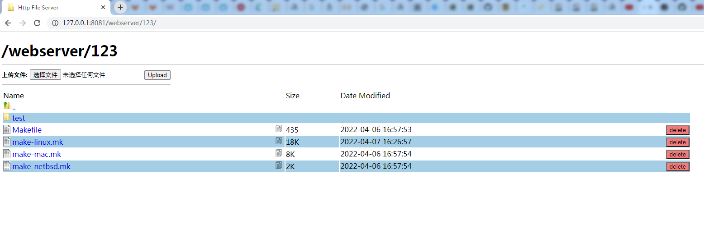

# http-file-server

`http-file-server` is a dependency-free HTTP file server. fork from https://github.com/sgreben/http-file-server



## 特点

- 优化了显示页面
- 优化页面删除功能
- 添加文件路径复制功能
- 去掉目录压缩功能

## Examples

### Serving a path at `/`

```sh
$ http-file-server -p 8081 -u -d /webserver=share
2022/04/07 11:01:44 serving local path "F:\\share" on "/webserver/"
2022/04/07 11:01:44 redirecting to "/webserver/" from "/"
2022/04/07 11:01:44 http-file-server.exe listening on ":8081"
```

## Use it

```text
http-file-server [OPTIONS] [[ROUTE=]PATH] [[ROUTE=]PATH...]
```

```text
Usage of http-file-server:
  -a string
    	(alias for -addr) (default ":8080")
  -addr string
    	address to listen on (environment variable "ADDR") (default ":8080")
  -p int
    	(alias for -port)
  -port int
    	port to listen on (overrides -addr port) (environment variable "PORT")
  -q	(alias for -quiet)
  -quiet
    	disable all log output (environment variable "QUIET")
  -r value
    	(alias for -route)
  -route value
    	a route definition ROUTE=PATH (ROUTE defaults to basename of PATH if omitted)
  -ssl-cert string
    	path to SSL server certificate (environment variable "SSL_CERTIFICATE")
  -ssl-key string
    	path to SSL private key (environment variable "SSL_KEY")
  -u	(alias for -uploads)
  -uploads
    	allow uploads (environment variable "UPLOADS")
  -d    (alias for -deletes)
  -deletes
        allow deletes (environment variable "DELETES")
```
